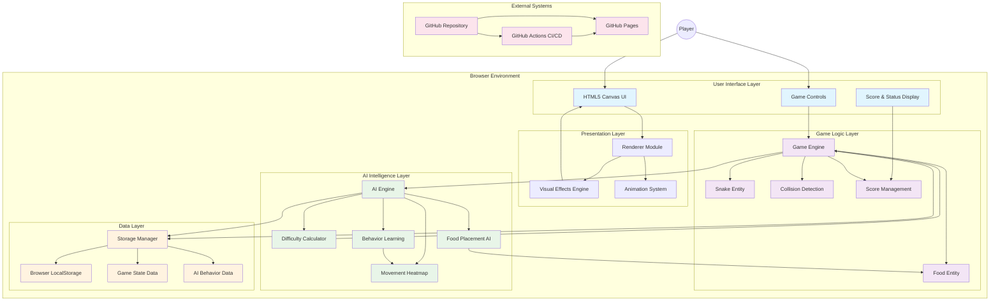
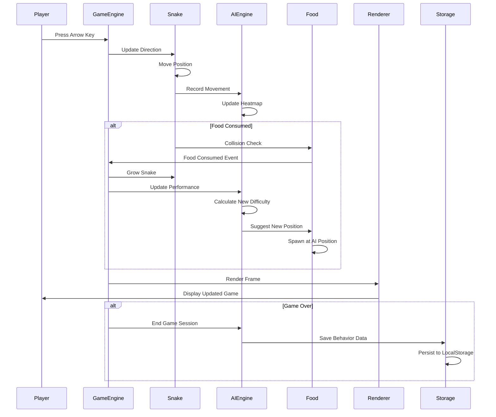
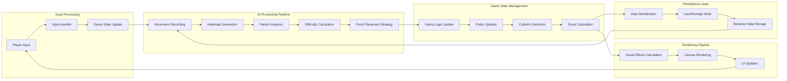
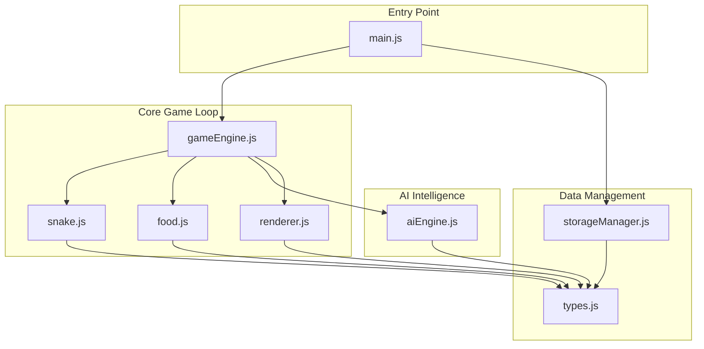
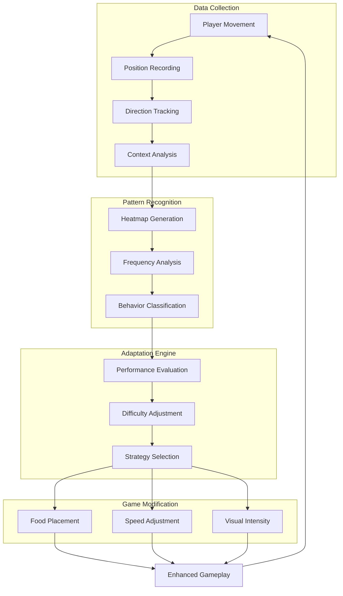
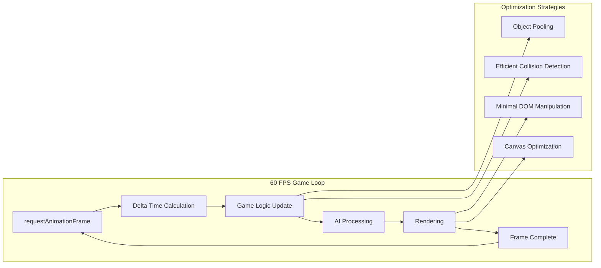
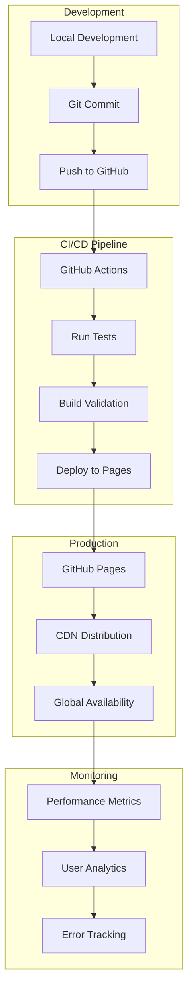

# 🏗️ AI-Adaptive Snake Game Architecture

## System Overview

The AI-Adaptive Snake Game follows a modular, layered architecture that separates concerns while enabling real-time AI learning and adaptation.

## High-Level Architecture Diagram

## Component Interaction Flow

## Data Flow Architecture

## Module Dependencies

## AI Learning Architecture

## Performance Architecture

## Deployment Architecture

## Key Architectural Principles

### 1. **Separation of Concerns**
- Each module has a single, well-defined responsibility
- Clear interfaces between components
- Minimal coupling, high cohesion

### 2. **Real-time AI Integration**
- Non-blocking AI processing
- Continuous learning during gameplay
- Immediate adaptation to player behavior

### 3. **Performance-First Design**
- 60 FPS target with efficient game loop
- Optimized rendering pipeline
- Minimal memory allocation during gameplay

### 4. **Data-Driven Architecture**
- Persistent behavior learning
- Configurable game parameters
- Extensible AI strategies

### 5. **Browser-Native Implementation**
- No external dependencies
- Uses standard web APIs
- Cross-browser compatibility

## Technology Stack

| Layer | Technology | Purpose |
|-------|------------|---------|
| **Frontend** | HTML5 Canvas | Game rendering |
| **Logic** | Vanilla JavaScript (ES6+) | Game engine and AI |
| **Storage** | LocalStorage API | Data persistence |
| **Testing** | Jest + fast-check | Unit and property-based testing |
| **CI/CD** | GitHub Actions | Automated testing and deployment |
| **Hosting** | GitHub Pages | Static site hosting |

## Scalability Considerations

- **Modular Design**: Easy to add new AI strategies or game features
- **Plugin Architecture**: AI components can be extended or replaced
- **Performance Monitoring**: Built-in FPS tracking and optimization
- **Data Management**: Efficient storage and retrieval of learning data

This architecture enables the game to provide a personalized, adaptive experience while maintaining high performance and reliability across different browsers and devices.